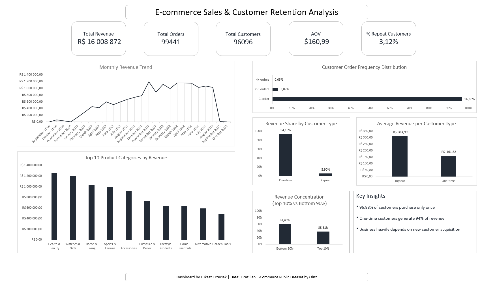

# 📊 E-commerce Sales & Customer Retention Analysis

## 🧩 Business Problem

The objective of this project was to analyze e-commerce sales performance and customer behavior using transactional data.  
The analysis focuses on revenue trends, customer retention, revenue concentration, and product performance to identify key business insights.

---

## 📁 Dataset

This project is based on the **Brazilian E-Commerce Public Dataset (Olist)**.

The dataset includes transactional data such as:

- Customers  
- Orders  
- Order items  
- Payments  
- Products  

Time range of the data:

**September 2016 – October 2018**

The initial months in 2016 contain limited transaction data, reflecting the early stage of platform activity. 

The final month includes incomplete data, resulting in lower reported revenue.

---

## 🛠 Tools Used

- **MySQL** – data querying and analysis  
- **DBeaver** – database management  
- **Microsoft Excel** – dashboard and visualization  
- **GitHub** – project documentation  

---

## 📈 Key Performance Indicators (KPIs)

The following business metrics were calculated:

- Total Revenue  
- Total Orders  
- Total Customers  
- Average Order Value (AOV)  
- Repeat Customer Rate  

> Note: Orders may contain multiple payments.  
> Therefore, Average Order Value (AOV) was calculated at the order level.

---

## 🔍 Key Insights

- **96.88%** of customers made only one purchase.
- Only **3.12%** of customers are repeat buyers.
- One-time customers generate **94% of total revenue**.
- The top 10% of customers generate **38.51% of total revenue**.
- Revenue increased significantly throughout 2017, peaking in November (likely influenced by seasonal effects such as Black Friday).
- The business heavily depends on continuous new customer acquisition.

---

## 📊 Revenue Analysis

### Monthly Revenue Trend
Revenue shows strong growth during 2017 and stabilization in 2018.  
The final month contains lower values due to incomplete data.

### Revenue Distribution by Customer Type
Revenue is primarily generated by one-time customers, indicating extremely low retention.

### Revenue Concentration
Revenue does not follow the classic 80/20 Pareto distribution.  
The top 10% of customers contribute 38.51% of total revenue, suggesting a relatively distributed revenue structure.

---

## 🛍 Product Performance

The analysis identified the top 10 product categories by revenue.  
Health & Beauty and Watches & Gifts generate the highest sales volumes.

---

## 📌 Customer Behavior Analysis

Customer segmentation by purchase frequency:

- 1 order – 96.88%
- 2–3 orders – 3.07%
- 4+ orders – 0.05%

This indicates very low customer retention and limited repeat purchasing behavior.

---

## 📊 Dashboard

The Excel dashboard includes:

- KPI summary  
- Monthly revenue trend  
- Revenue share by customer type  
- Customer purchase frequency distribution  
- Revenue concentration (Top 10% vs Bottom 90%)  
- Top 10 product categories
- Average Revenue per Customer Type

---

## 📂 Project Structure

ecommerce-sales-analysis/

│

├── sql/

│ └── analysis.sql

│

├── excel/

│ └── dashboard.xlsx

│

├── screenshots/

│ └── dashboard.png

│

└── README.md

---

## 🎯 Conclusion

The analysis reveals extremely low customer retention and strong dependence on one-time buyers.  

The findings suggest that implementing retention strategies could significantly improve long-term revenue stability and customer lifetime value.

The project applies SQL-based data analysis and dashboard reporting techniques to extract actionable business insights from transactional data.
